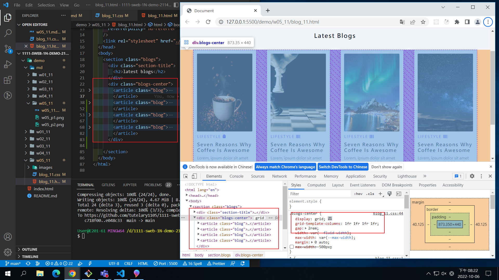
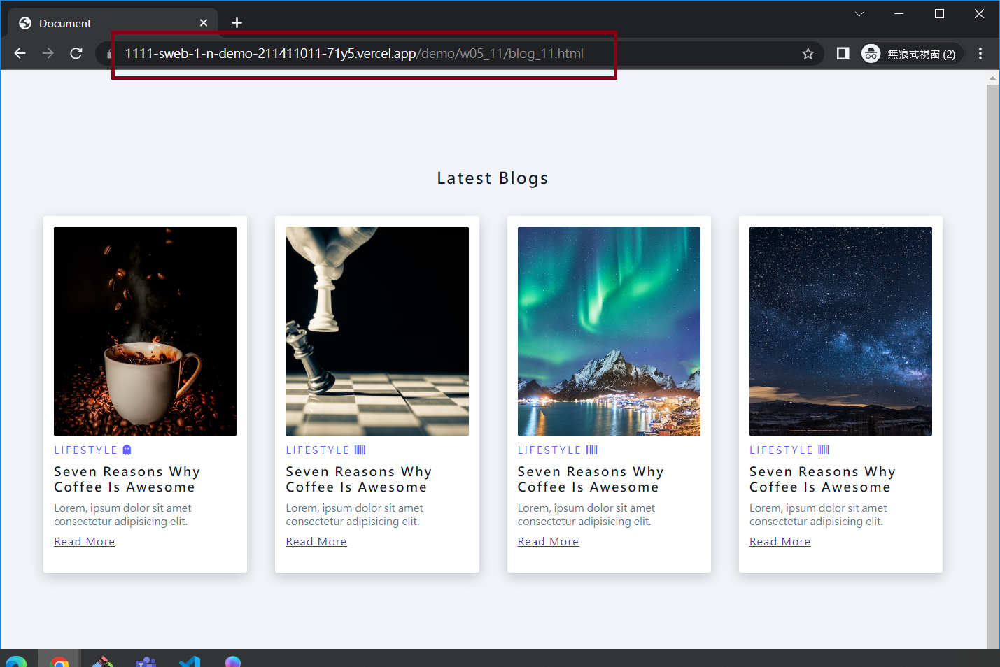
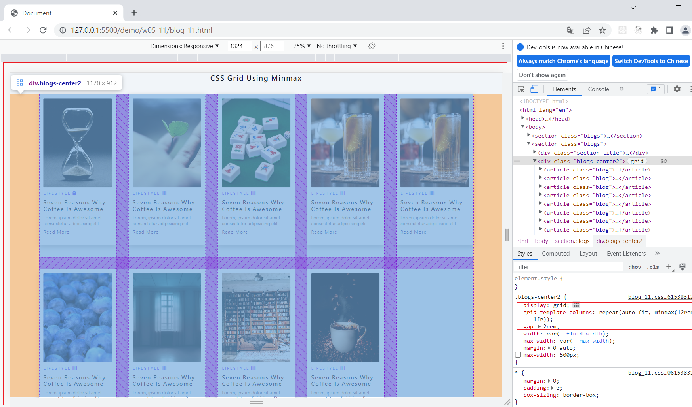
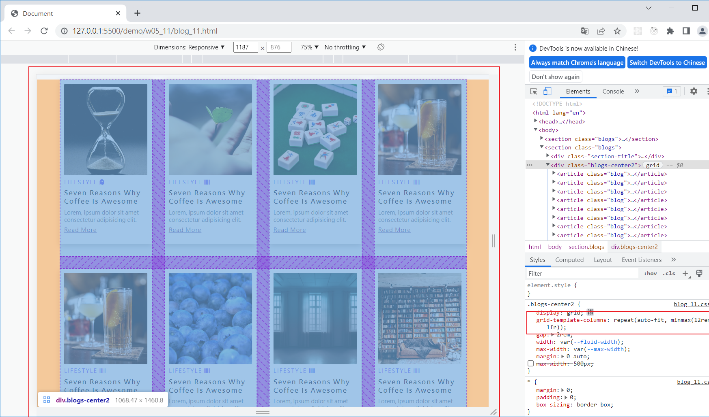
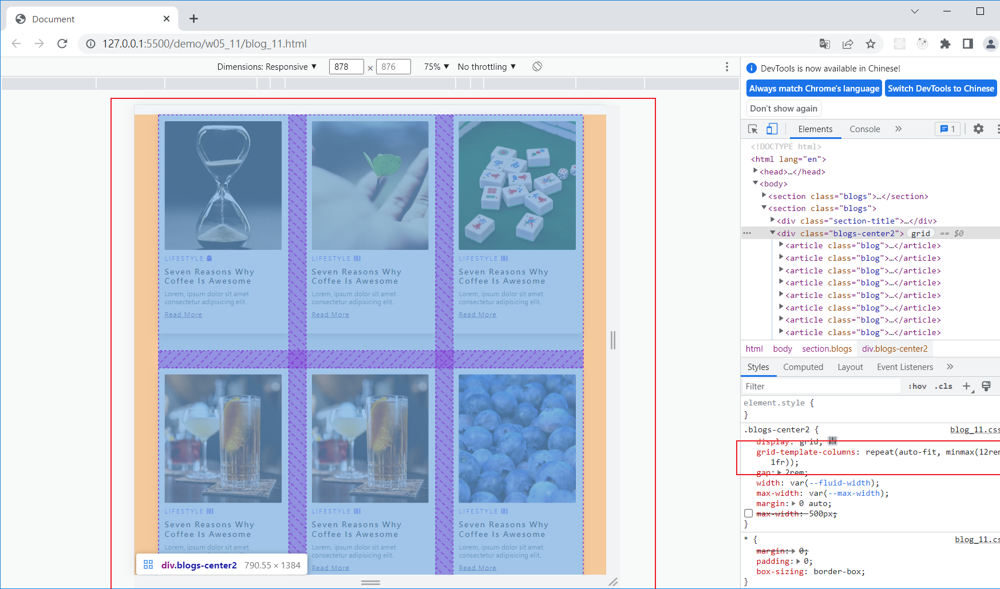
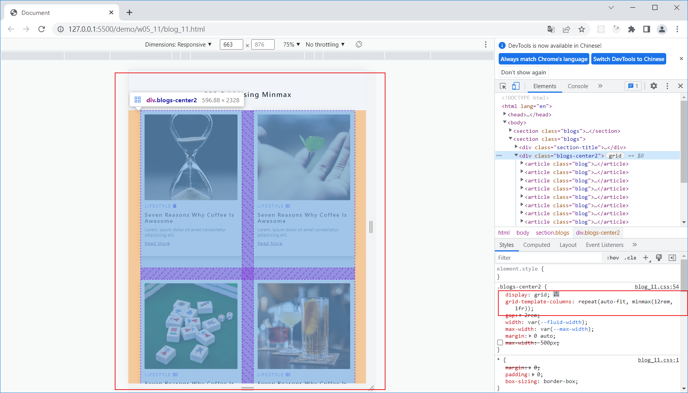
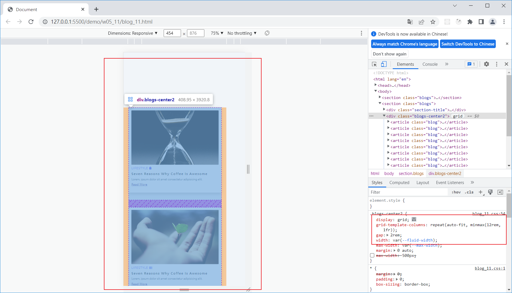

### Github repo url

[my github repo](https://github.com/tutelary1105/1111-sweb-1N-demo-211411011)

### W05-P1: add w04 link in index.html

### W05-P2: get 9 photo using small sizes

### W05-P3: Use grid to show 4 photos in a row

### W05-P4: Add w05 link in index.html, and show it in Vercel

### W05-P5: Using css grid with minmax to display 9 photos

### W05-logs: W4 all logs

$ git log --pretty=format:"%h%x09%an%x09%ad%x09%s" --after="2022-10-05"
95518c7 tutelary1105 Thu Oct 6 21:19:21 2022 +0800 W05-P5: Using css grid with minmax to display 9 photos
04d2efb tutelary1105 Thu Oct 6 20:28:37 2022 +0800 W05-P4: Add w05 link in index.html, and show it in Vercel
e14585a tutelary1105 Thu Oct 6 20:25:58 2022 +0800 W05-P3: Use grid to show 4 photos in a row
67badcd tutelary1105 Thu Oct 6 20:23:47 2022 +0800 W05-P3: Use grid to show 4 photos in a row
e048c33 tutelary1105 Thu Oct 6 19:27:57 2022 +0800 W05-P2: get 9 photo using small sizesc718f00 tutelary1105 Thu Oct 6 18:55:58 2022 +0800 W05-P1: add w04 link in index.html
c42f0bf tutelary1105 Thu Oct 6 18:36:01 2022 +0800 add w04_11 blog_11.html
