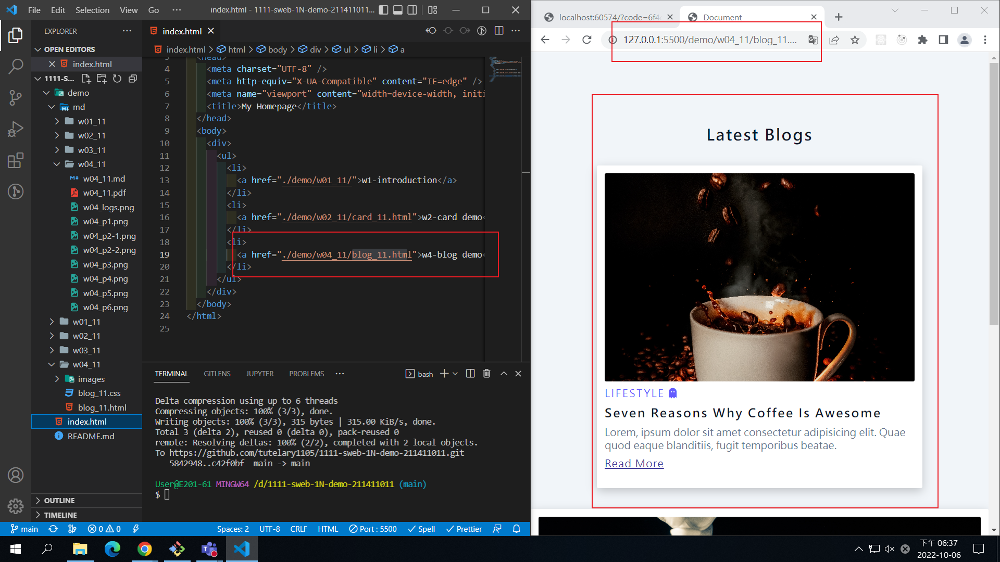
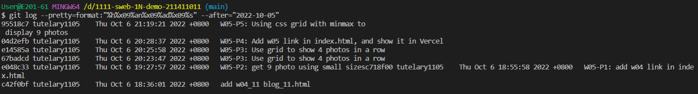

### Github repo url

[my github repo](https://github.com/tutelary1105/1111-sweb-1N-demo-211411011)

### W05-P1: add w04 link in index.html

### W05-logs: W4 all logs

$ git log --pretty=format:"%h%x09%an%x09%ad%x09%s" --after="2022-09-28"
4d3a5b0 tutelary1105 Thu Sep 29 21:29:54 2022 +0800 W04-P6: Add font awesome css, add two icons
159d857 tutelary1105 Thu Sep 29 21:02:05 2022 +0800 W04-P5: finish w03 blog demo with hover and transition
79381c7 tutelary1105 Thu Sep 29 19:51:28 2022 +0800 W04-P4: add index.html as homepage, and show in Vercel
33ad326 tutelary1105 Thu Sep 29 19:44:50 2022 +0800 W04-P4 add index.html as homepage
fae8a38 tutelary1105 Thu Sep 29 19:29:34 2022 +0800 W04-P3: Share Github repo to teacher and TA
2251c23 tutelary1105 Thu Sep 29 19:07:09 2022 +0800 W04-P2:Deploy Github to Vercel
528eee9 tutelary1105 Thu Sep 29 18:51:19 2022 +0800 W04-P1:Use git pull to update README.md
5e79d44 tutelary1105 Thu Sep 29 18:28:38 2022 +0800 Create README.md
