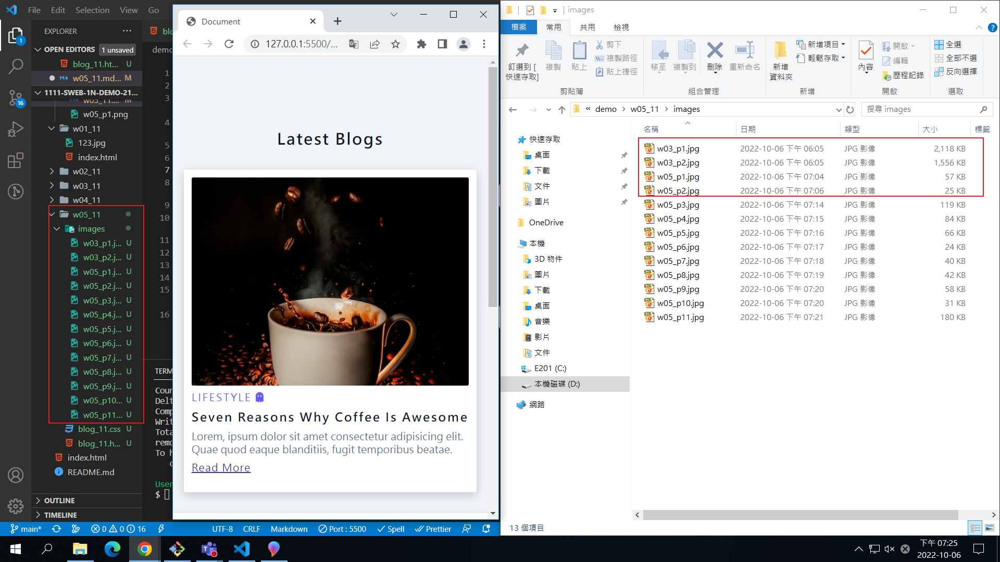

### Github repo url

[my github repo](https://github.com/tutelary1105/1111-sweb-1N-demo-211411011)

### W05-P1: add w04 link in index.html

### W05-P2: get 9 photo using small sizes

### W05-P3: Use grid to show 4 photos in a row

### W05-logs: W4 all logs

$ git log --pretty=format:"%h%x09%an%x09%ad%x09%s" --after="2022-09-28"
