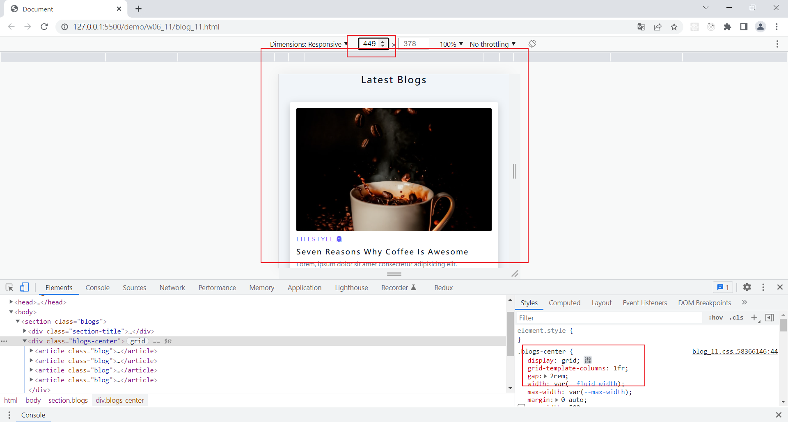
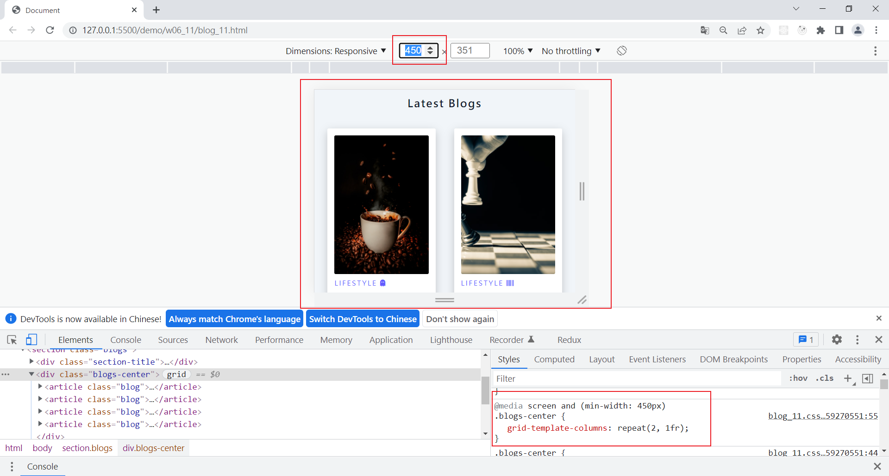
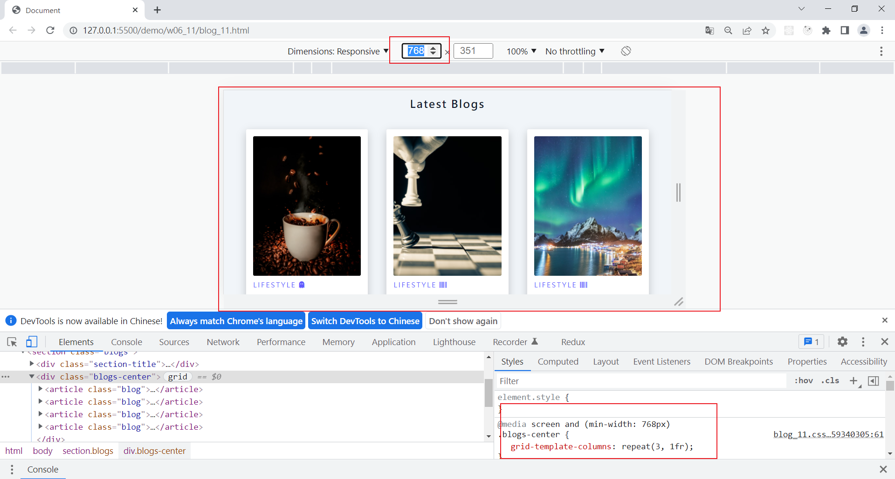
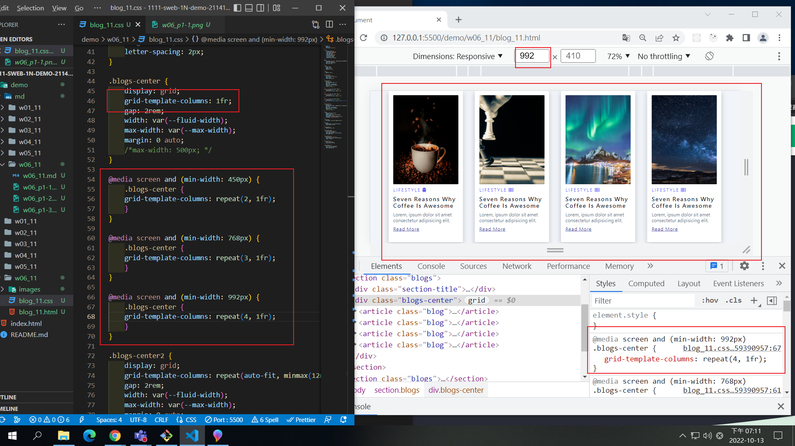
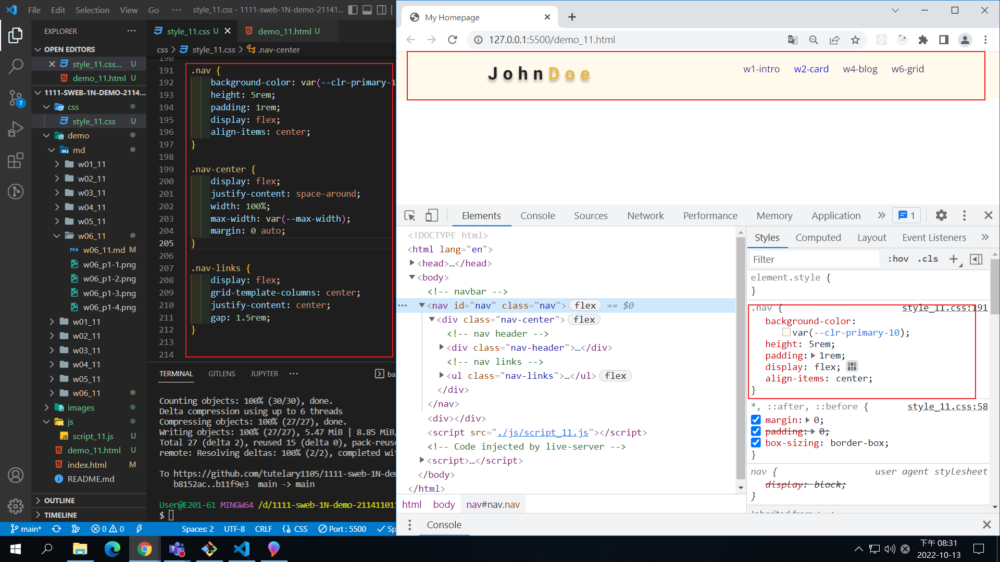
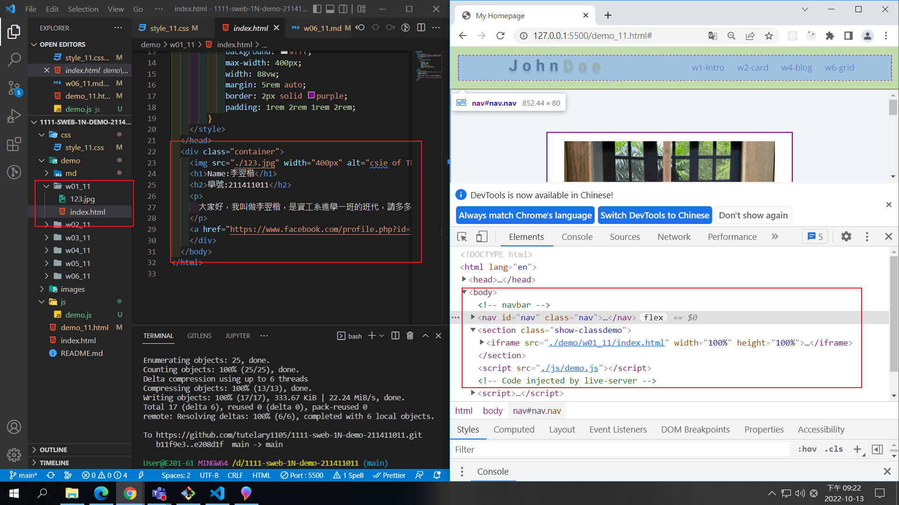
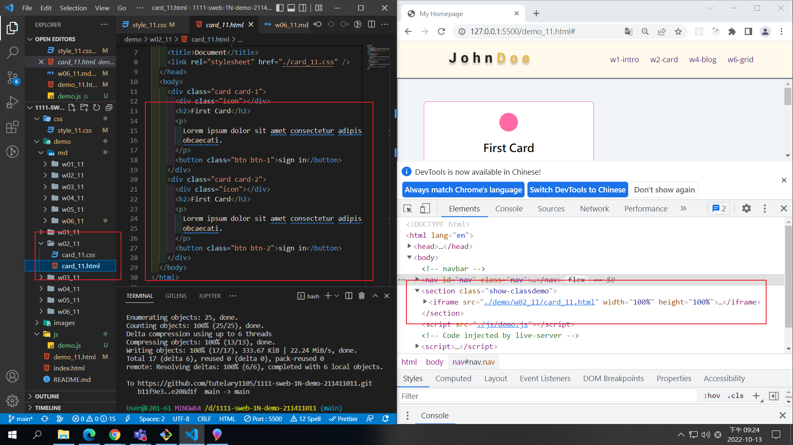
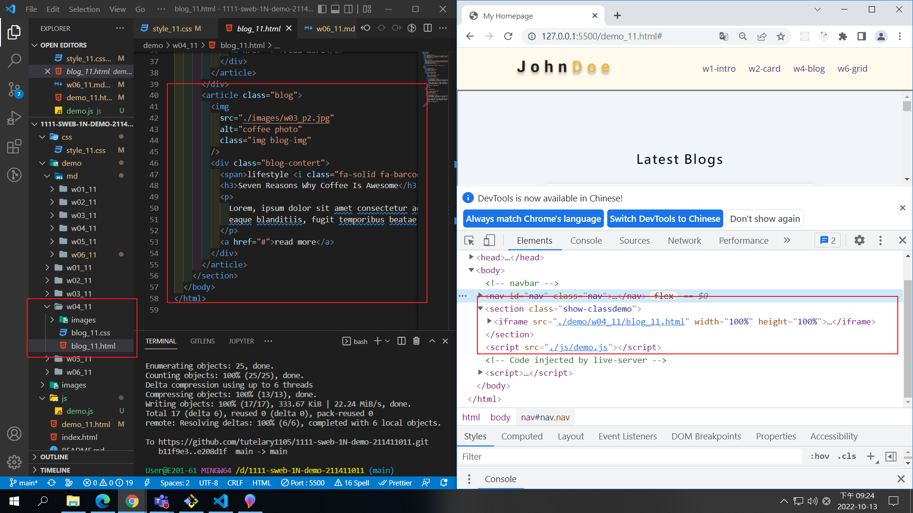
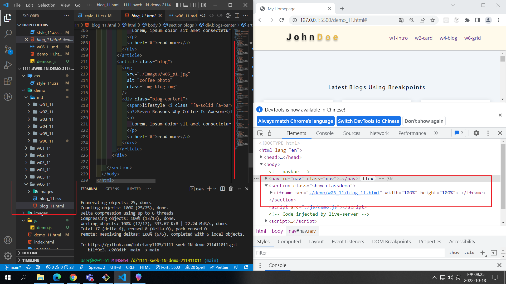
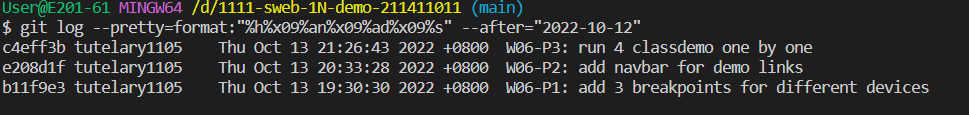

### Github repo url

[my github repo](https://github.com/tutelary1105/1111-sweb-1N-demo-211411011)

### W06-P1: add 3 breakpoints for different devices

### W06-P2: add navbar for demo links

### W06-P3: run 4 classdemo one by one

### W06-logs: W6 all logs

$ git log --pretty=format:"%h%x09%an%x09%ad%x09%s" --after="2022-10-12"
c4eff3b tutelary1105 Thu Oct 13 21:26:43 2022 +0800 W06-P3: run 4 classdemo one by one
e208d1f tutelary1105 Thu Oct 13 20:33:28 2022 +0800 W06-P2: add navbar for demo links
b11f9e3 tutelary1105 Thu Oct 13 19:30:30 2022 +0800 W06-P1: add 3 breakpoints for different devices
