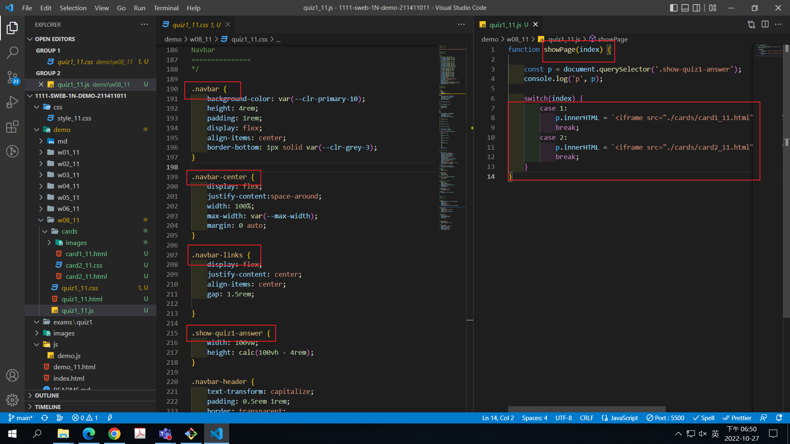
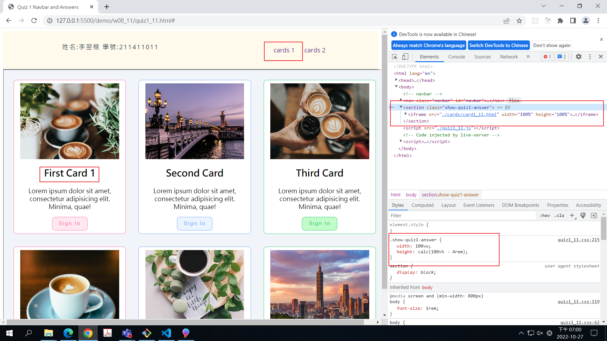
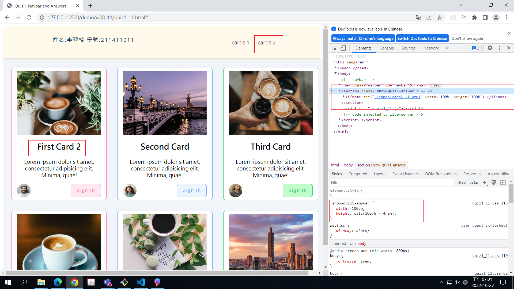
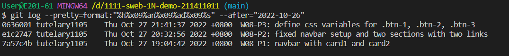

### Github repo url

[my github repo](https://github.com/tutelary1105/1111-sweb-1N-demo-211411011)

### W08-P1: navbar with card1 and card2

### W06-P2: add navbar for demo links

### W06-P3: run 4 classdemo one by one

### W08-logs: W8 all logs

$ git log --pretty=format:"%h%x09%an%x09%ad%x09%s" --after="2022-10-26"
