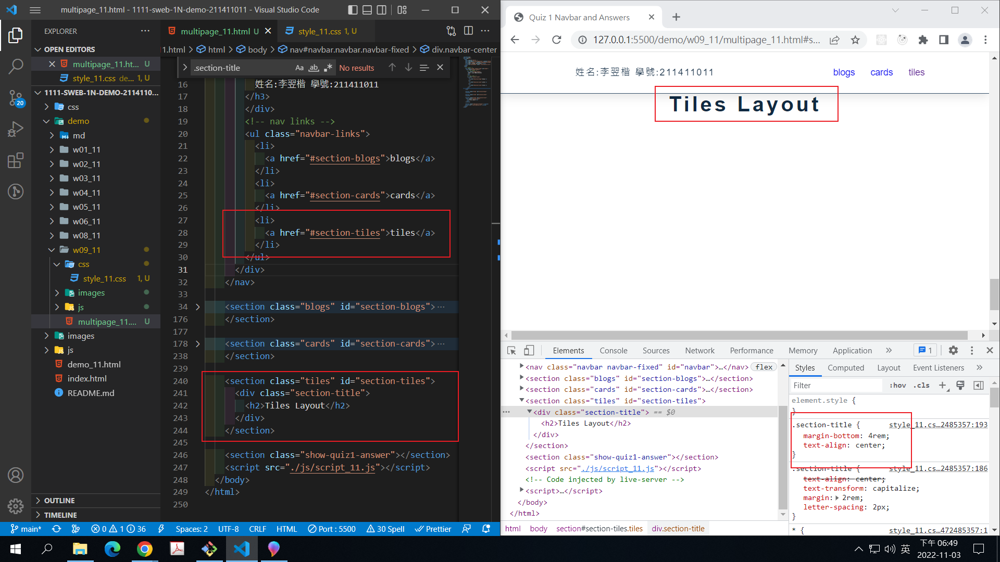
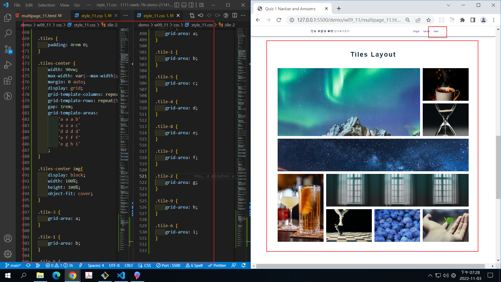
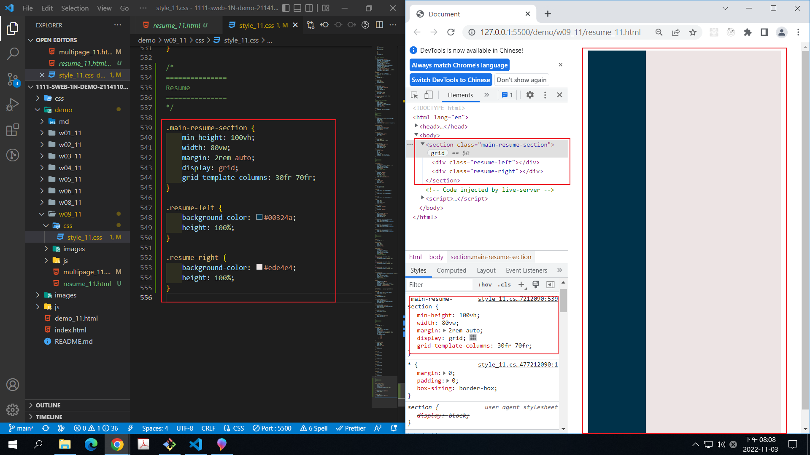
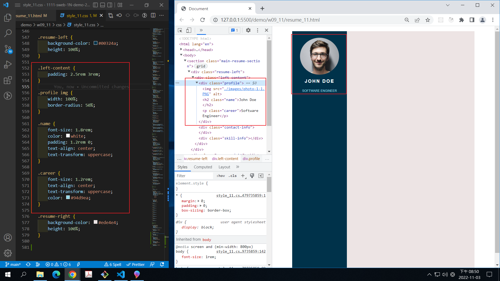
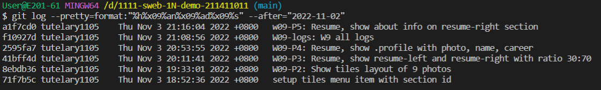

### Github repo url

[my github repo](https://github.com/tutelary1105/1111-sweb-1N-demo-211411011)

### W09-P1: setup tiles menu item with section id

### W09-P2: Show tiles layout of 9 photos

### W09-P3: Resume, show resume-left and resume-right with ratio 30:70

### W09-P4: Resume, show .profile with photo, name, career

### W09-logs: W9 all logs

$ git log --pretty=format:"%h%x09%an%x09%ad%x09%s" --after="2022-1
1-02"
2595fa7 tutelary1105 Thu Nov 3 20:53:55 2022 +0800 W09-P4: Resume, show .profile with photo, name, career
41bff4d tutelary1105 Thu Nov 3 20:11:41 2022 +0800 W09-P3: Resume, show resume-left and resume-right with ratio 30:70
8ebdb36 tutelary1105 Thu Nov 3 19:33:01 2022 +0800 W09-P2: Show tiles layout of 9 photos
71f7b5c tutelary1105 Thu Nov 3 18:52:36 2022 +0800 setup tiles menu item with section id
