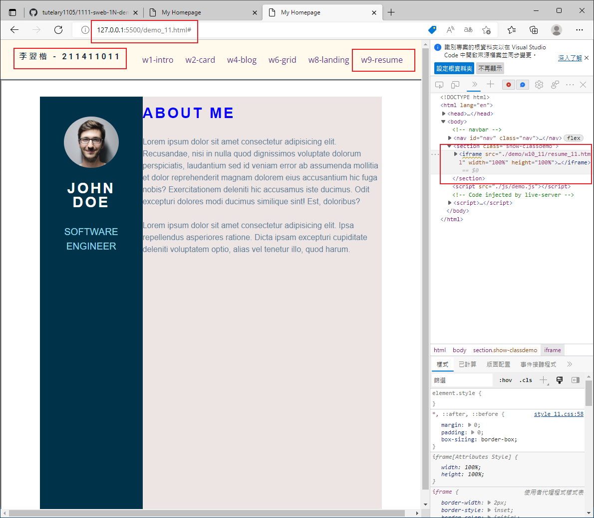
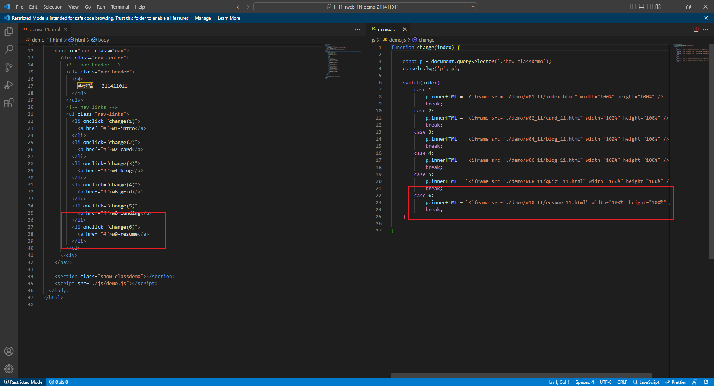
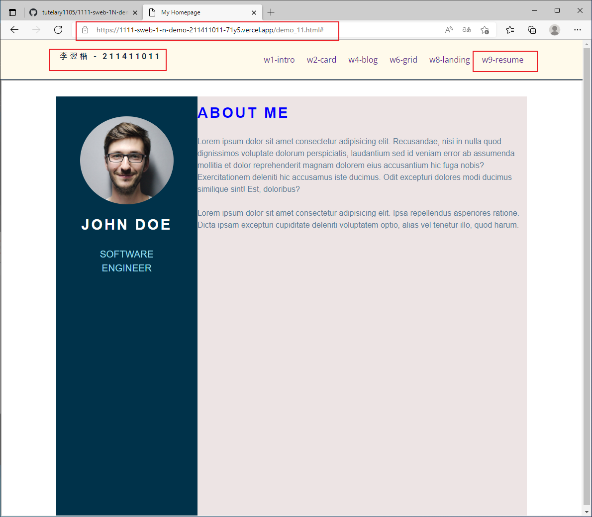
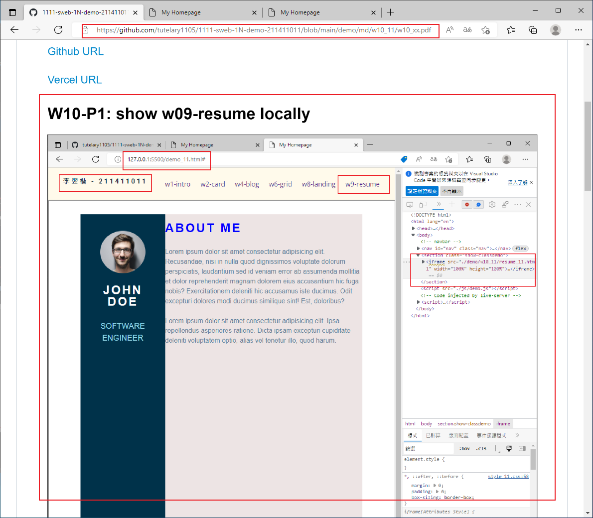

## Github & Vercel URL

[Github URL](https://github.com/tutelary1105/1111-sweb-1N-demo-211411011)

[Vercel URL](https://1111-sweb-1-n-demo-211411011-71y5.vercel.app/)

### W10-P1: show w09-resume locally





### W10-P2: show w09-resume from Vercel



### W10-P3: show w10_xx.md from Github



### W10-logs: show all logs of Week 9


```
$ git log --pretty=format:"%h%x09%an%x09%ad%x09%s" --after="2022-11-10"

```
