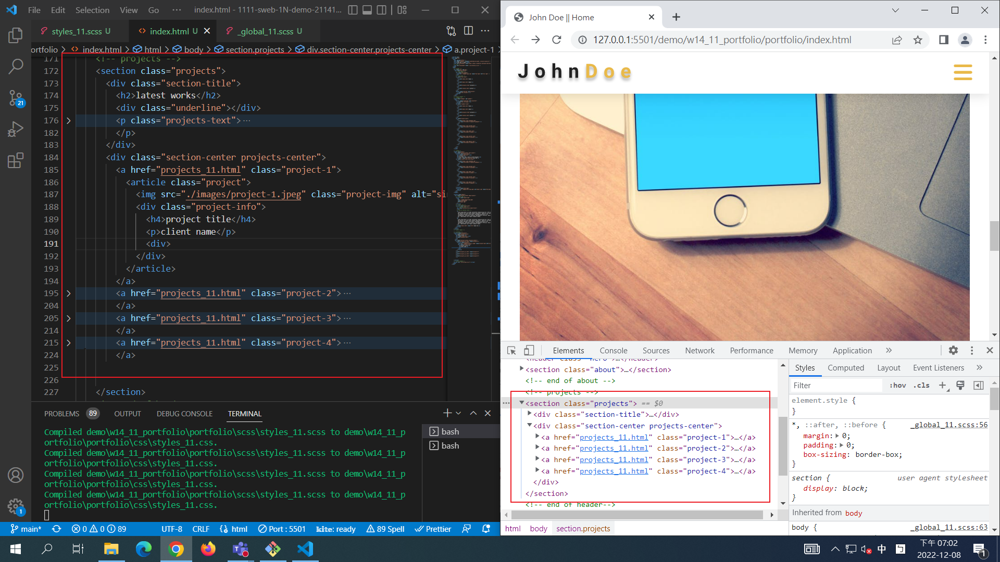
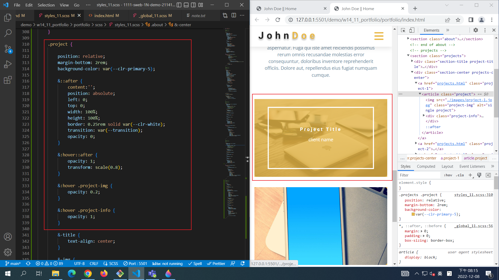
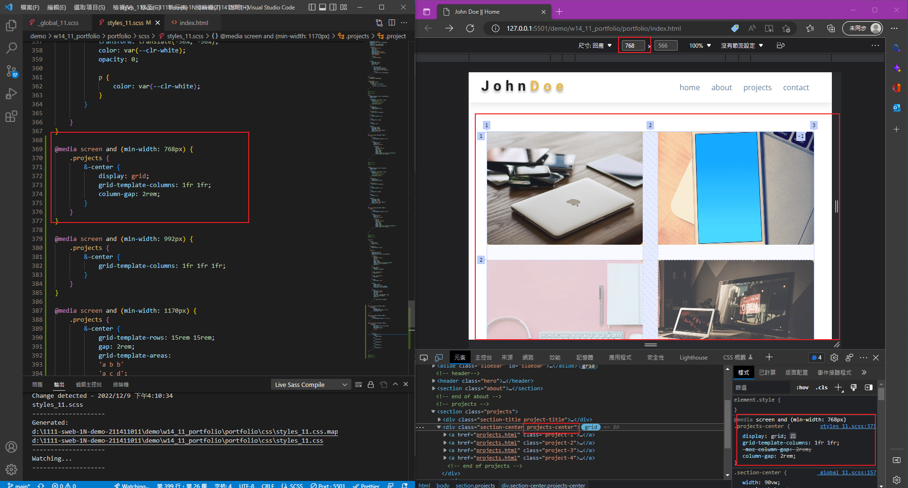
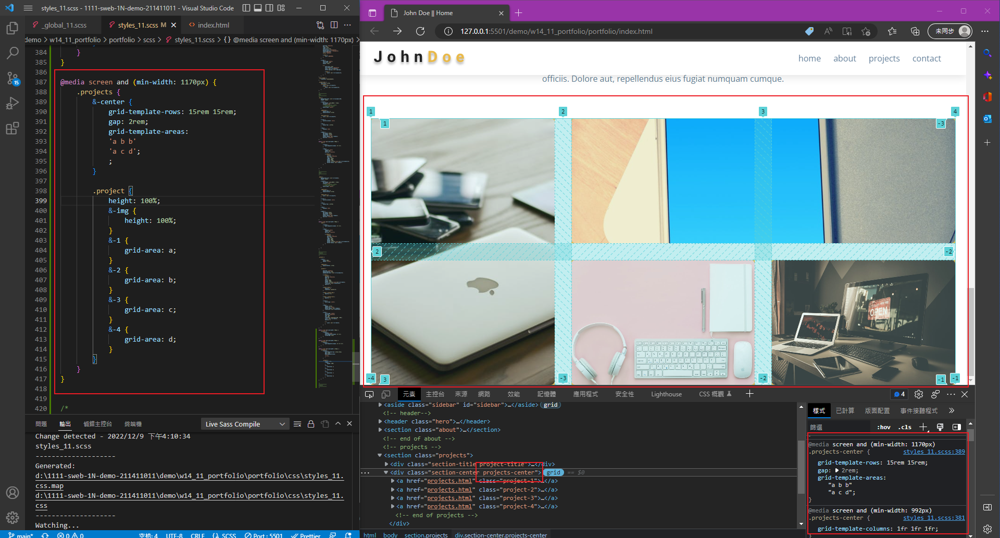
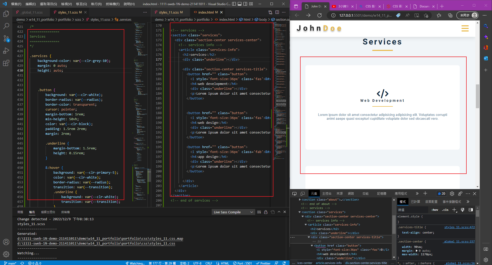
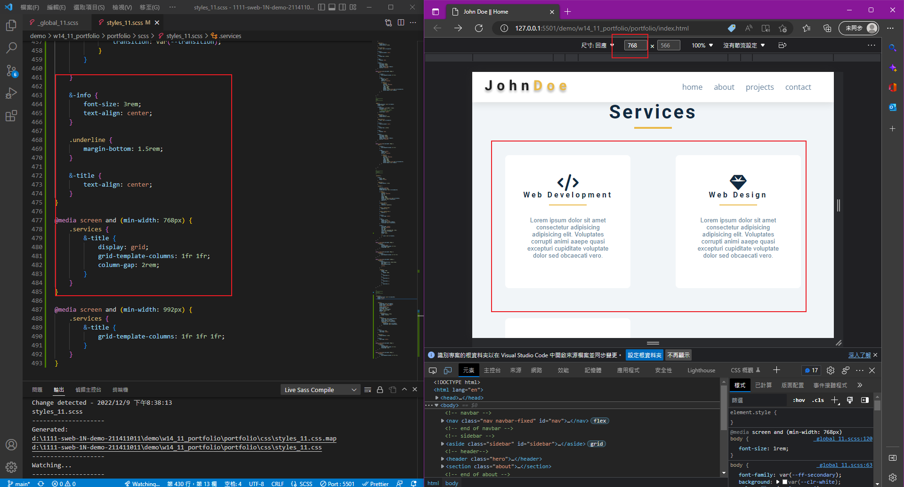
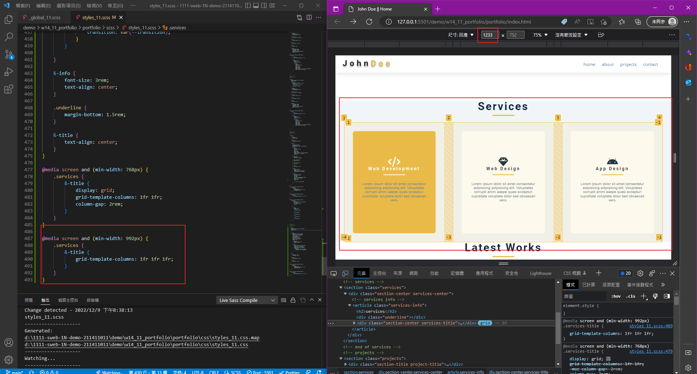

## Github & Vercel URL

[Github URL](https://github.com/tutelary1105/1111-sweb-1N-demo-211411011)

[Vercel URL](https://1111-sweb-1-n-demo-211411011-71y5.vercel.app/)

### W14-P1: html for projects section



### W14-P2: projects section for phone



### W14-P3: projects section for another three breakpoints






### W14-P4: service section with 2 breakpoints (done by students)








### W14-logs: show all logs


```
$ git log --pretty=format:"%h%x09%an%x09%ad%x09%s" --after="2022-12-07"

```
