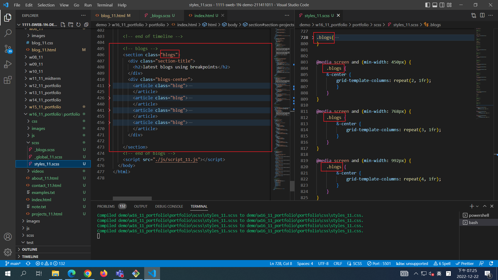
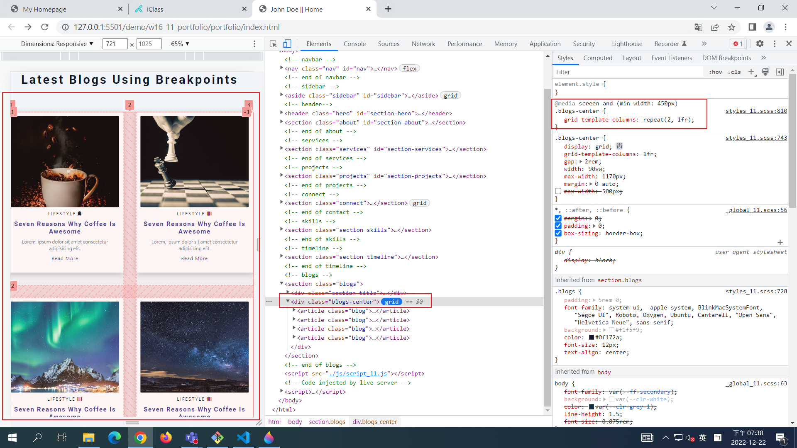

## Github & Vercel URL

[Github URL](https://github.com/tutelary1105/1111-sweb-1N-demo-211411011)

[Vercel URL](https://1111-sweb-1-n-demo-211411011-71y5.vercel.app/)

### W16-P1: add w6 blogs data into index.html as blogs section





### W15-P2: add video banner


### W15-P3: show contact_xx.html with navbar and footer with date shown in year


### W15-P4: 完成 skills 進度條


### W15-P5: 完成 timeline 時間軸


### W15-logs: show all logs


```
$ git log --pretty=format:"%h%x09%an%x09%ad%x09%s" --after="2022-12-16"

```
2962263 tutelary1105    Sat Dec 17 13:27:05 2022 +0800  W15-P5: 完成 timeline 時間軸
19cb6cd tutelary1105    Sat Dec 17 08:13:00 2022 +0800  W15-P4: 完成 skills 進度條
1c76bfe tutelary1105    Sat Dec 17 07:26:37 2022 +0800  W15-P3: show contact_xx.html with navbar and footer with date shown in year
eb5255d tutelary1105    Sat Dec 17 06:30:39 2022 +0800  W15-P2: add video banner
6b50b0b tutelary1105    Sat Dec 17 06:05:42 2022 +0800  W15-P1: connect section using mp4 video
