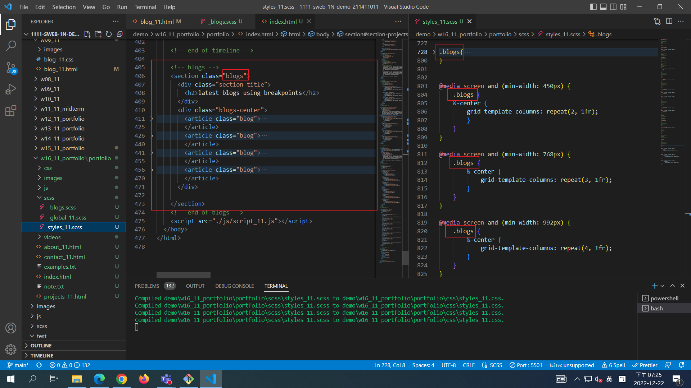
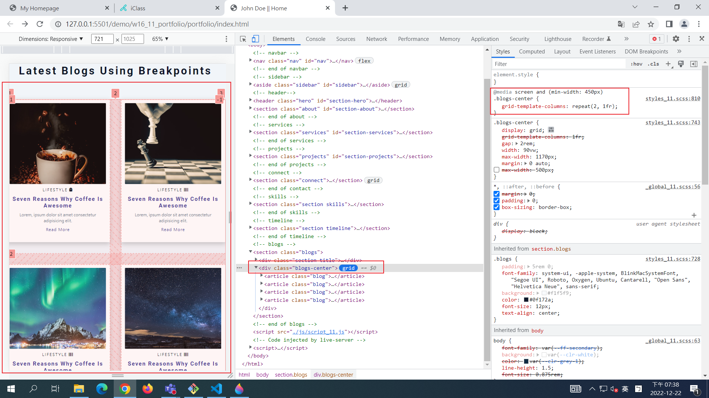

## Github & Vercel URL

[Github URL](https://github.com/tutelary1105/1111-sweb-1N-demo-211411011)

[Vercel URL](https://1111-sweb-1-n-demo-211411011-71y5.vercel.app/)

### W16-P1: add w6 blogs data into index.html as blogs section





### W16-P2: add w8 section-tiles-laytout to project_xx.html


### W16-logs: show all logs


```
$ git log --pretty=format:"%h%x09%an%x09%ad%x09%s" --after="2022-12-21"

cc9e84d tutelary1105    Tue Dec 27 06:26:02 2022 +0800  W16-P2: add w8 section-tiles-laytout to project_xx.html
04707f5 tutelary1105    Thu Dec 22 19:42:39 2022 +0800  W16-P1: add w6 blogs data into index.html as blogs section
